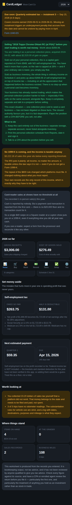
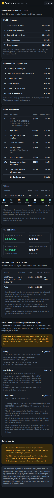

# CardLedger

Bookkeeping and tax compliance for a trading card resale business — buying at
shows, buying online, opening sealed product, sending cards to grading, and
selling on eBay, Whatnot, TCGplayer and across a table.

Built around Davis County, Utah. Runs on your own machine; your financial
records never leave it.

| Home | Schedule C worksheet |
|---|---|
|  |  |

---

## Read this first

**This is bookkeeping software, not tax advice.** It has not been reviewed by a
CPA, an enrolled agent, or an attorney. It computes from records you enter and
from published rates, and it shows the source for every rate so you can check
it. Have a professional review your first return, and anything unusual after
that. Where the law is genuinely unsettled — and for a card seller some of it
is — the app says so rather than picking a side and sounding confident.

**Three things it will keep telling you, because they cost the most money:**

1. **Self-employment tax is about 14 cents of every dollar of profit**, before
   income tax. Nobody withholds it. Set it aside the day the money lands.
2. **Quarterly estimated payments are real deadlines.** The penalty accrues per
   period, so a payment missed in September cannot be fixed by paying more in
   April.
3. **Buying inventory does not create a deduction.** The cost is deducted when
   the item *sells*. A big December buy is not a tax move.

---

## Quick start

```bash
npm install
npm run serve
```

Open <http://localhost:8420>. The startup log also prints a
`http://192.168.x.x:8420` address — that is the one to use on your phone, and
it installs to the home screen as an app.

Fill in **You** (settings) first. Filing status, state and any day-job wages
change the tax numbers materially.

---

## What it does

### Purchases and cost basis

Recording a purchase asks what you paid and what you got, then splits the cost
across the items. That split — the **cost basis** — is what decides your
taxable profit when each piece eventually sells, so it is shown live before you
save.

The default is to allocate in proportion to what each item is worth, which is
the general rule for property bought in a lot. Shipping and non-recoverable
sales tax ride along into the cost of the goods, because that is what they are.

### Opening sealed product

This is the hard part of card bookkeeping and the reason a generic accounting
package does not fit.

You pay $161.64 for a booster box. You open it and hold 360 cards: one worth
$2,600, a handful worth $5–$40, and 340 worth essentially nothing. What is the
cost basis of the $2,600 card?

Not $161.64 — that would deduct the whole box against one sale and leave the
rest of the cards costing nothing. Not $0.45 either, which treats a chase card
and a common as equally expensive.

CardLedger allocates in proportion to value, so the chase card carries almost
all of the basis. Total income over the life of the box is identical under any
method; what changes is **which year** it lands in, and that matters when cards
sit unsold across a year end.

The box itself is kept as a zero-basis record, so the provenance of a card with
two cents of basis and a $2,600 sale price is still there years later.

### Grading

A submission's fees, shipping both ways and insurance are added to the basis of
the specific cards in it. They reduce the gain when the card sells rather than
being deducted the year you paid them.

That is a judgement call. For a dealer, expensing grading currently is also
defensible, and a CPA may prefer it. The allocation is recorded per card so it
can be unwound.

### Inventory held for resale versus a personal collection

The distinction that matters most, and the one most likely to save you real
money.

Cards held **as inventory** produce ordinary business income on Schedule C,
subject to self-employment tax. Cards held **as a personal collection** are
capital assets: reported on Form 8949, **no self-employment tax**, and if held
more than a year the rate is capped at 28%.

One person can hold both, and courts have said so — but the burden is on you,
and it turns on documentation and separation. CardLedger keeps investment
holdings out of business purchases, out of inventory, and out of cost of goods
sold entirely, and produces a dated schedule of them to print and sign.

**What keeps that distinction alive:** store them separately, never buy or sell
them through the business account, and never list them for sale. Sales effort
is what most often defeats it.

### Sales

A sale records what the buyer paid, what the platform kept, what postage cost,
and relieves each item's basis into cost of goods sold — in one transaction, so
revenue and cost can never come apart.

Two treatments that trip people up, handled explicitly:

- **Shipping the buyer paid is income**, and the label you bought is a
  deduction. Netting them understates both sides and makes your return stop
  matching the 1099-K.
- **Sales tax you collect is not income.** It is the state's money. When a
  marketplace collects and remits it, it never touches your figures at all.

### Sales tax at shows

Utah sources a sale at a temporary event to **where the event is**, not where
you live. A Layton seller at a Sunset show charges 7.15%, not Layton's 7.25%.
Every Davis County jurisdiction is built in.

Collected sales tax is a **trust fund tax** — you hold it for the state,
personal liability attaches, and it should not sit in the same account as your
profit.

### Mileage

Logged per trip with the business purpose, which is what the substantiation
rules ask for, and valued at the rate in force on the day.

That last part matters for 2026: the standard rate changed mid-year, from 72.5¢
through 30 June to 76¢ from 1 July. A single annual rate understates half the
year. The report shows the split.

### The Schedule C worksheet

Every figure, with its line number, ready to read onto the form or hand to a
preparer.

Cost of goods sold is computed **two independent ways** — the form's
beginning-plus-purchases-less-ending, and the basis actually relieved by sales —
and compared. They must agree to the cent. If they do not, something is wrong in
the books and the app says so instead of reporting a confident number.

### What the platforms will report about you

The 1099-K threshold moved twice in five years and the confusion is still doing
damage. The current rule, restored retroactively by the One, Big, Beautiful Bill
Act: a marketplace files only when it settles **more than $20,000** for you
across **more than 200 transactions**. Both tests, not either.

Three things follow, and the app says all three because every one of them costs
people money:

- **The threshold is the platform's, not yours.** It decides whether eBay must
  mail a form. It decides nothing about whether the money is taxable. The IRS
  says so directly: all income, no matter the amount, is taxable — even if you
  don't get a Form 1099-K.
- **It is per platform.** $15,000 on eBay and $15,000 on Whatnot is $30,000 of
  income and zero forms.
- **Card readers have no threshold at all.** One $40 swipe on a Square reader at
  a show puts you on a 1099-K, even if everything else you did was cash.

The report shows what each platform is expected to report, how far each is from
the thresholds, and the gap between the form's gross figure and Schedule C
line 1 — while there is still time to keep the fee and refund records, rather
than in January when they have to be reconstructed.

### What a dollar of profit actually costs

Self-employment tax is only half the bill. Income tax is the other half, and for
anyone with a day job it is usually the larger one — because business profit
**stacks on top of wages** and is taxed at the marginal rate those wages already
reached.

That stacking is what makes "set aside 30%" wrong in both directions:

| Wages | SE tax on $10,000 profit | Federal income tax on it | Set aside |
|---|---|---|---|
| $0 | $1,412.96 | $0 — the standard deduction covers it | 14% |
| $45,000 | $1,412.96 | 9.6% on the margin | 23% |
| $90,000 | $1,412.96 | 17.6% on the margin | 30% |
| $150,000 | $1,412.96 | 19.2% on the margin | 32% |

Those marginal rates are lower than the headline brackets because the section
199A deduction takes 20% off qualified business income, and the app applies it.

The app computes federal income tax against the 2026 rate schedules for your
filing status, the standard deduction, the deduction for half of
self-employment tax, and section 199A. It states what it does **not** model —
itemised deductions, credits of any kind, the preferential long-term capital
gains rates, alternative minimum tax — rather than implying the number is a
return.

Utah is shown separately at its flat 4.45%, because Utah has no separate
estimated-payment system for individuals: it settles with the annual return.

### What a card is worth, which is not what it cost

The **Stock** tab has a "What is it worth?" button on every item. It writes to an
estimated value and to nothing else. Your books carry the card at what you paid,
and that is the figure that reaches Schedule C — line 33 of the form asks how you
valued closing inventory, and the answer is always **(a) Cost**.

Attaching a $749.99 value to a card that cost $306.39 moves no number on the
return. That is enforced by tests, not by good intentions: allocation is
invariant to scaling every estimate by 1000×, and market value appears in none
of the tax computation files.

**About eBay, since that is what everyone asks for first.** eBay's sold prices
are not obtainable. Verified against eBay's own documentation:

- The Finding API, which carried `findCompletedItems`, was decommissioned on
  **4 February 2025**.
- The Browse API returns **active listings only** — its published OpenAPI spec
  contains `lastSoldDate`, `lastSoldPrice` and `itemSales` exactly **zero** times
  across 407 KB of schema.
- The Marketplace Insights API is the only eBay endpoint with sold prices and is
  **restricted to invited partners**; its spec URL now 404s while Browse returns
  200.

So the app uses **TCGCSV**, a free daily mirror of TCGplayer prices covering
Pokémon, Magic, Yu-Gi-Oh and 89 other games. No key, no signup.

What it gives you is the **raw, ungraded market price** — not a completed sale,
and not the value of a slab. Every quote is stamped as such, each printing is
kept separate (a reverse holo is not its base card), and there is **no sports
card data at all**, which the app says plainly rather than substituting a wrong
number. For sports and for graded cards, you look it up and type it in, and the
app records where it came from.

It never guesses a card from a name. You pick the game and the set, then search
within it — because the previous version of this app tried to parse identity out
of listing titles and produced confident nonsense.

### Money spent before you open

Section 195: pre-opening costs are not business expenses, because there was no
business. They become deductible in the year trading **begins** — $5,000
immediately, phasing out dollar for dollar above $50,000 and gone at $55,000,
with the rest spread over 180 months from the starting month.

This is the deduction a new business most often loses outright, because nobody
writes the costs down. Show admissions and travel to scout, an hour with a CPA,
the city licence, a price-guide subscription — all of it counts, and none of it
is recoverable later.

The trap runs the other way too. **Cards bought before opening are not start-up
costs.** They are inventory: the cost comes back through cost of goods sold when
they sell, however much you spend. Equipment is not a start-up cost either — it
is depreciated when placed in service.

The business "begins" when it first offers cards for sale, not when you decided
to do it and not when you bought your first box.

### Quarterly estimated tax

Both safe harbours, and the lower one wins: 90% of this year's tax, or 100% of
last year's (110% if last year's AGI was over $150,000). A first year has no
prior-year return, so there is no fixed protection — the app says that rather
than implying otherwise.

The four 2026 instalments are due **15 April, 15 June, 15 September** and
**15 January 2027**. They are not quarters: the periods are 3, 2, 3 and 4
months, which is why June always feels early.

---

## Where the numbers come from

Every rate and threshold carries the year it applies to, the authority behind
it, a source URL and a confidence rating. **Settings** lists all of them.

Figures are split into two kinds because they age very differently:

- **Statutory** — written into the code and unchanged for years. The 15.3%
  self-employment rate, the 92.35% multiplier, the $400 floor, the $200,000
  additional Medicare threshold. Safe.
- **Indexed** — re-set annually. The Social Security wage base, mileage rates,
  standard deductions, the small-business gross receipts test. **Carrying one
  of these forward silently is the most likely way this app could produce a
  wrong return**, so an unverified figure makes the app refuse to compute and
  say which number it needs, rather than guessing.

Confirmed for 2026 against primary sources:

| Figure | Value | Source |
|---|---|---|
| Social Security wage base | $184,500 | IRS Pub 926 |
| Self-employment tax | 15.3% (12.4% + 2.9%) | IRC 1401 |
| Standard mileage | 72.5¢ to 30 Jun, 76¢ from 1 Jul | IRS Notice 2026-10, Ann. 2026-11 |
| Small business gross receipts test | $32,000,000 | Rev. Proc. 2025-32 |
| Business meals | 50% | IRC 274(n) |
| Home office simplified | $5/sq ft, 300 sq ft cap | Rev. Proc. 2013-13 |
| De minimis safe harbor | $2,500 per item | Treas. Reg. 1.263(a)-1(f) |
| Federal rate schedules | all five, 2026 | Rev. Proc. 2025-32 §.01 |
| Standard deduction | $16,100 single, $32,200 joint, $24,150 HoH | Rev. Proc. 2025-32 |
| Form 1099-K threshold | over $20,000 AND over 200 sales | IRC 6050W(e), OBBB Act |
| Start-up costs | $5,000, phasing out over $50,000, 180 months | IRC 195 |
| Home office storage exception | exclusive use waived for inventory | IRC 280A(c)(2), Pub. 587 |
| Home-business fee bar | no fee absent material offsite impact | Utah Code 10-1-203(8)(a) |
| Utah income tax | 4.45% | Utah S.B. 60 (2026) |
| Davis County sales tax | 7.15% or 7.25% | Utah Tax Commission, Q3 2026 |

---

## Getting legal

The **Setup** tab is a checklist separated into federal, Utah, county and city,
because those are separate agencies with separate rules. Getting an EIN does not
register you with Utah; a Utah sales tax licence is not a city business licence.

Items are marked **required**, **conditional** (with what triggers them) or
**recommended**. Anything the app could not confirm from a primary source says
so instead of stating it as fact — city business licensing in particular varies
by city and needs checking with yours.

See [docs/COMPLIANCE.md](docs/COMPLIANCE.md) for the detail.

---

## Your data

One SQLite file at `data/cardledger.db`. Back it up by copying it.

- **Automatic backups** on every startup, keeping the last 30.
- **Export** to CSV and JSON per year — purchases, inventory, sales, sale lines,
  expenses, mileage, grading, plus the computed worksheet and a readme naming
  the headline figures and anything unresolved. Plain formats, no lock-in.
- **Audit log** of every change to a money-bearing row, with values before and
  after. A figure that changed with no record of why is what an examiner asks
  about.

```bash
npm run backup                                  # back up now
curl localhost:8420/api/export/2026 > 2026.json # everything for a year
```

---

## Commands

```bash
npm run dev        # API on :8420 and UI on :5273, both hot-reloading
npm run serve      # build and serve from :8420
npm test           # the test suite
npm run typecheck  # server and web
npm run backup     # back up the database
```

## Layout

```
src/
  domain/       money as integer cents, and the business model
  ledger/       purchases, basis allocation, opening packs, grading
  reports/      cost of goods sold, profit and loss, capital gains, export
  tax/          figures with sources, self-employment, income tax, estimated tax,
                start-up costs, 1099-K, Utah
  valuation/    price lookups, which can never touch cost basis
  compliance/   the checklist and the deadline calendar
  db/           SQLite schema, queries, audit log
  routes/       HTTP API
web/            React interface, mobile first
docs/           compliance guide and methodology
```

## Adding a tax year

Copy `src/tax/years/2026.ts`, change the year, and **check every figure marked
`indexed` against its source**. Register it in `src/tax/registry.ts`. Asking for
a year with no figures returns an error rather than using another year's
numbers.
