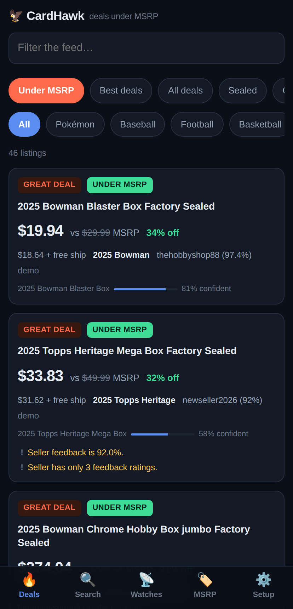
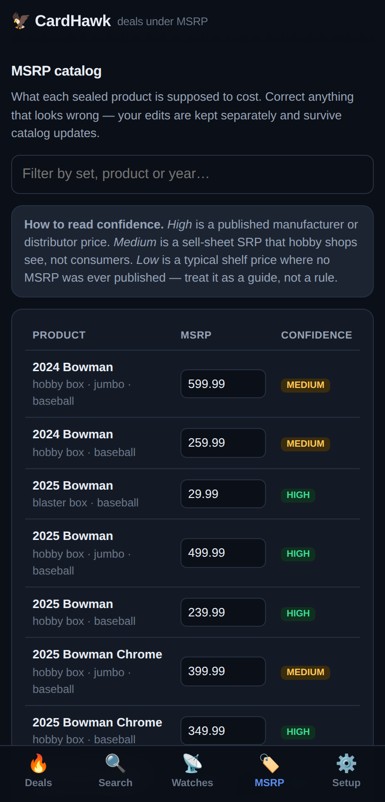
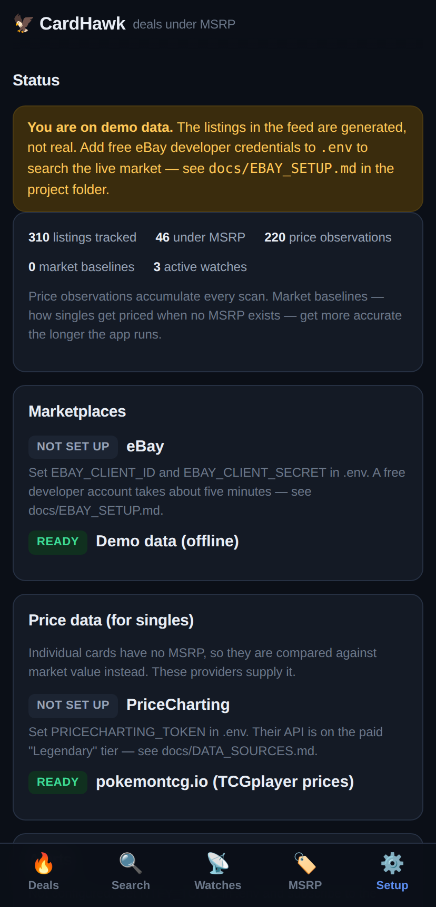

# CardHawk

A self-hosted deal finder for trading cards and sealed packs. It watches
marketplaces for baseball, football, basketball, Pokémon, Magic, One Piece and
Yu-Gi-Oh! product, works out what each listing *should* cost, and labels the
ones priced below it — with **UNDER MSRP** called out as its own badge.

Runs on your PC. Open it on your phone over the same wifi, or install it to your
home screen as an app.

| Deals feed | MSRP catalog | Setup |
|---|---|---|
|  |  |  |

*(Screenshots use the built-in demo data.)*

---

## The honest version of what this does

Two sentences worth reading before you set it up, because they shape everything:

**Sealed product has an MSRP. Single cards do not.** A booster box, an Elite
Trainer Box or a blaster has a manufacturer price you can compare against. A
single Charizard is a random output of a pack — no manufacturer ever suggested a
price for it, and any tool that claims otherwise is making a number up. CardHawk
compares sealed product against MSRP and singles against **market value** from
real price data, and it tells you which one it used on every card.

**eBay does not give out sold prices, and scraping them is against their terms.**
The sold-comp API is restricted to approved partners, and eBay's User Agreement
and robots.txt both prohibit scraping the completed-listings pages. So CardHawk
uses the official Browse API for live listings, gets real market values from
price-data providers, and builds its own comp history over time by noticing
which listings disappear. It gets better the longer you run it.

---

## Quick start

```bash
git clone <this repo> && cd Cards
npm install
cp .env.example .env
npm run serve
```

Open <http://localhost:8787>. The startup log also prints a `http://192.168.x.x:8787`
address — that is the one to open on your phone.

It works immediately with **demo data** so you can see what it does. Everything
in the feed will be labelled as generated until you add credentials.

### Making it real (5 minutes, free)

Add eBay API credentials to `.env`. They cost nothing and take about five
minutes: **[docs/EBAY_SETUP.md](docs/EBAY_SETUP.md)** walks through it.

```env
EBAY_CLIENT_ID=YourApp-xxxxx-PRD-xxxxxxxxx-xxxxxxxx
EBAY_CLIENT_SECRET=PRD-xxxxxxxxxxxx-xxxx-xxxx-xxxx-xxxx
EBAY_SHIP_TO_ZIP=90210
```

Restart, go to **Watches**, and hit **Run now**.

### Getting deals pushed to your phone

Pick an unguessable topic name, install the [ntfy](https://ntfy.sh) app,
subscribe to that topic, and set it in `.env`:

```env
NTFY_TOPIC=cardhawk-8fj2n4kd9
ALERT_MIN_DISCOUNT_PCT=20
```

No account, no signup. Any deal at least 20% under its benchmark now pushes to
your phone with a tap-through to the listing.

---

## Using it

**Deals** — the feed. `Under MSRP` is the headline filter; the others narrow by
how good the deal is, what kind of item it is, or how soon an auction closes.

**Search** — a one-off lookup, scored the same way but not saved, so browsing
around does not skew the price history your watches build up.

**Watches** — saved searches the app re-runs on a schedule. Three are created
for you on first run. Each has its own interval and its own alert threshold.

**MSRP** — the catalog, editable. If you know a price better than the app does,
fix it; your edits are stored separately and survive catalog updates.

**Setup** — what is connected, what is not, and how much of your eBay API quota
you have spent today.

---

## What the labels mean

| Badge | Sealed vs MSRP | Anything vs market value |
|---|---|---|
| **Under MSRP** | Below the manufacturer's price. Shown alongside whichever badge below applies. | n/a — singles have no MSRP |
| Steal | 35%+ under | 35%+ under |
| Great deal | 20–35% under | 20–35% under |
| Good deal | 8–20% under | 10–20% under |
| Fair price | within 5% | within 10% |
| Overpriced | above that | above that |
| **Too good to be true** | 60%+ under | 70%+ under |
| Not scored | no benchmark, or something makes the comparison meaningless | |

The MSRP ladder is tighter because MSRP is a fixed published number, while
market value is an estimate with real error bars around it.

**"Too good to be true" is the important one.** A sealed booster box at 70% off
is not a bargain nobody else spotted. It is an empty box, a pre-order, a
counterfeit, or a title the parser misread. CardHawk labels those instead of
burying them, so you can see what it caught.

Every card shows a **confidence** bar and states what it compared against. Low
confidence deals get quietly demoted rather than shouted about.

---

## What it refuses to do

These are deliberate, and they are why the numbers are worth trusting:

- **It will not guess between SKUs.** "Bowman hobby box" is $239.99 and "Bowman
  HTA jumbo hobby box" is $499.99. If a title does not say which, CardHawk says
  so instead of picking one and inventing a 50% discount.
- **It will not price an auction that nobody has bid on.** A $1 auction with six
  days left is not 99% off. It becomes scoreable within 6 hours of closing, or
  once it has real bids.
- **It will not pool things that are not the same product.** Japanese and
  English prints, graded and raw, near-mint and played, jumbo and standard —
  all priced separately.
- **It will not treat one seller as a market.** A shop with twenty identical
  listings contributes at most three data points.
- **It will not scrape anything that prohibits it.** See
  [docs/DATA_SOURCES.md](docs/DATA_SOURCES.md) for what is and is not allowed,
  and why.

---

## How it works

Full detail in **[docs/HOW_IT_WORKS.md](docs/HOW_IT_WORKS.md)**. In short:

```
marketplace  →  parse the title  →  find a benchmark  →  score  →  label
                (what IS this?)     (MSRP or market)     (how far under?)
```

Every listing is also recorded as a price observation, which is how market
baselines for singles are built. When a listing you were tracking vanishes
before its end date, that is recorded as a likely sale — the only legitimate
source of completed-sale data available without a restricted API.

---

## Configuration

Everything is in `.env`; `.env.example` documents each setting. The ones that
matter most:

| Setting | What it does |
|---|---|
| `EBAY_CLIENT_ID` / `EBAY_CLIENT_SECRET` | Live eBay listings. Free. |
| `EBAY_SHIP_TO_ZIP` | Makes shipping estimates real numbers instead of guesses. |
| `EST_TAX_RATE` | Added to landed cost. Set `0` to compare pre-tax. |
| `NTFY_TOPIC` | Push alerts to your phone. |
| `PRICECHARTING_TOKEN` | Paid. Adds sports-card and sealed market values. |
| `MAX_API_CALLS_PER_DAY` | Guard against burning your eBay quota. Default 4500 of 5000. |
| `SCHEDULER_ENABLED` | Set `false` to only scan on demand. |

## Commands

```bash
npm run dev        # API on :8787 and UI on :5173, both hot-reloading
npm run serve      # build everything and serve it from :8787
npm run scan       # run every watch once from the terminal, then exit
npm test           # 101 tests
npm run typecheck  # server and web
```

`npm run scan` is the one to put in cron if you would rather not leave a server
running.

## Project layout

```
src/
  parse/        listing titles -> structured product identity
  catalog/      MSRP lookup and SKU disambiguation
  pricing/      robust statistics, landed cost, scoring, labels
  sources/      marketplace adapters (eBay, demo) and comp providers
  pipeline/     ingest, scanner, baselines, scheduler
  db/           SQLite schema and queries
  routes/       HTTP API
web/            React PWA, mobile first
catalog/        MSRP and set data as editable JSON
docs/           setup guides and methodology
```

## Adding a marketplace

Implement `SourceAdapter` in `src/sources/`, register it in
`src/sources/registry.ts`. Parsing, scoring and storage are shared, so an
adapter only has to return raw listings. `src/sources/fixture.ts` is the
simplest example.

## Licence and fair use

For personal use. Respect the terms of any service you point it at — see
[docs/DATA_SOURCES.md](docs/DATA_SOURCES.md). Cached listing rows expire after
30 days by design, because eBay's API licence permits only limited intermediate
copies of their data.
